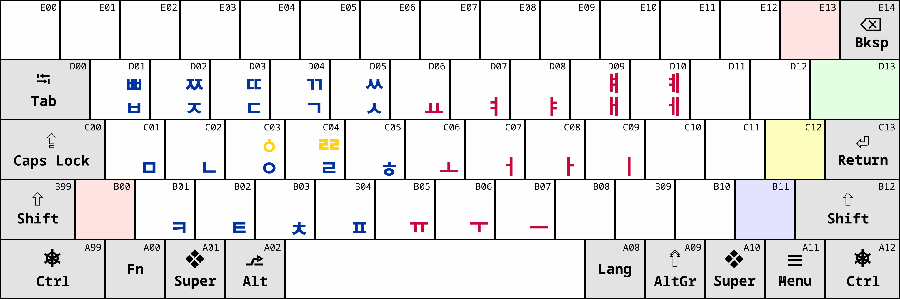
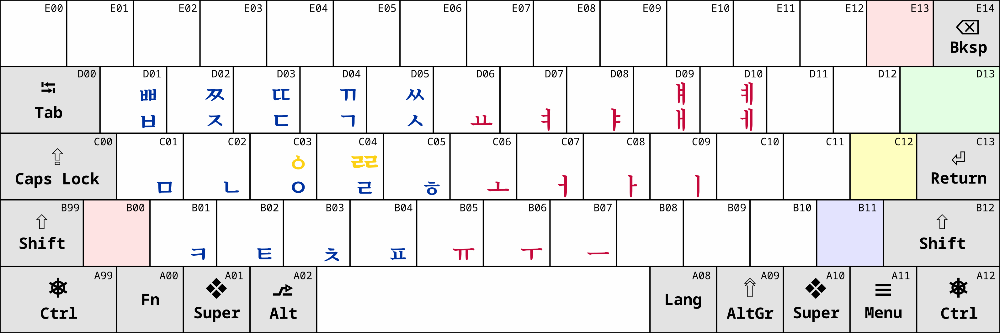

# 마부하미 한글 (Mabuhay Hangeul) IME

This is a Javascript-based IME (Input Method Editor) for typing 마부하미 한글 (Mabuhay Hangeul) (f. 삐ᄙᅵ삐너 한글 (Pilipino Hangeul)) easily in a Unicode-compliant manner. It works well with all Unicode-compliant browsers and fonts.

## About

The 마부하미 한글 (Mabuhay Hangeul) is a project that started out as an experiment to adapt and adopt 한글 (Hangeul) as the writing system for native Philippine languages. 한글 (Hangeul) is a writing system that was scientifically developed by 세종대왕 (Sejong the Great) to make it easy for everyone to learn how to write phonetically.

The project was originally named 삐ᄙᅵ삐너 한글 (Pilipino Hangeul), however, calling the project as 마부하미 한글 (Mabuhay Hangeul) is more meaningful.

### 마부하미 한글 (Mabuhay Hangeul)

The new name can mean the following:

* **Long live 세종대왕 (Sejong the Great)!** A great honour to a great king and teacher.
* **Welcome/Hello 한글 (Hangeul).** Welcoming the Korean writing script as an alternative to writing Philippine languages phonetically, aside from using the Latin script.

## How to run

1. Download this repository to your device.
2. Open `main.html` and start typing

## Keyboard layout

## Important note

Make sure to learn 마부하미 한글 (Mabuhay Hangeul) first by reading the [마부하미 한글 (Mabuhay Hangeul)](https://youronlyone.tiddlyhost.com/#Pilipino%20Hangeul) experiment page.

## Copyright and License

* Copyright © 2024 by Yahuhanan Yukiya Sese Cuneta.
* Licenses, unless otherwise specified:
  * Artistic works: **Creative Commons Attribution-ShareAlike (CC By-SA) 4.0 International License**.
  * Software code: **Apache 2.0 License** (same as the original project, see below).

## Attribution

The 마부하미 한글 (Mabuhay Hangeul) IME project was forked from the [Old Hangul Input Method](https://github.com/5hwb/Old-Hangul-Input-Method) project which was developed by [Perry Hartono](https://github.com/5hwb) under an **Apache 2.0 License**.

## Contact

* Fediverse: [@youronlyone@c.im](https://c.im/@youronlyone)
* [Online form](https://im.youronly.one/p/contact-us/)
